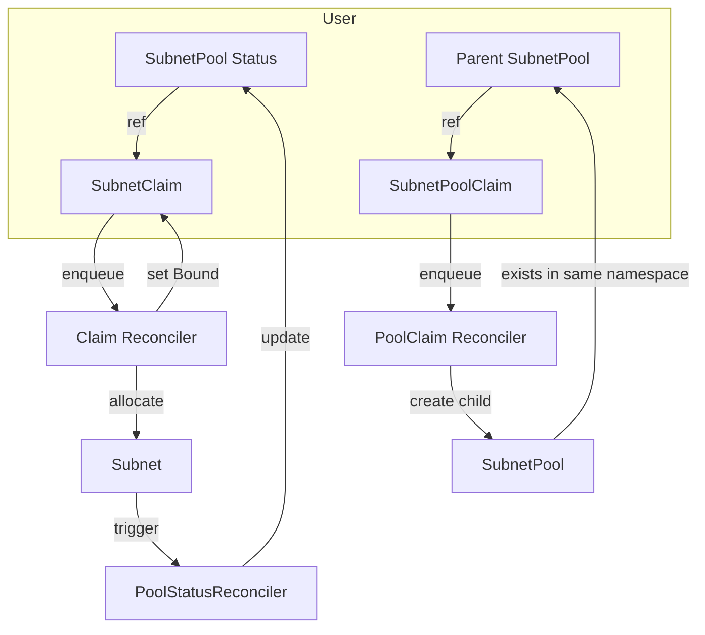

# Plexaubnet (CIDR Operator)

Declarative CIDR Management Operator for Multi-Cluster Kubernetes v1.30+

<!-- Badges -->
[](https://github.com/appthrust/plexaubnet/actions)  

---

## 1. Introduction

**Plexaubnet** is the OSS spin-off of the IPAM subsystem from the [Aquanaut Project](https://github.com/appthrust/aquanaut).  
It delivers declarative, idempotent CIDR assignment for clusters, tenants, or applications across multi-cluster environments.  
While designed to integrate seamlessly with Submariner, Calico and other CNI plug-ins, Plexaubnet works perfectly as a standalone operator.

**Key benefits**
- Self-service CIDR allocation via CRDs – no spreadsheets required
- O(1) look-ups through centralized field indexers
- Fine-grained block-size control with *Linear* and *Buddy* strategies
- Prometheus metrics and detailed status for full observability

---

## 2. Feature Overview

| Resource | Description |
| -------- | ----------- |
| **SubnetPool** | Defines CIDR range, block-size constraints and allocation strategy (*Linear* / *Buddy*) |
| **SubnetClaim** | Request a block (by block size or fixed CIDR) for a cluster / tenant |
| **Subnet** | Controller-generated allocation object |
| **SubnetPoolClaim** | Dynamically split an existing pool to create child SubnetPools |
| **Idempotent** | `spec.clusterID` prevents duplicate allocations |
| **Status & Metrics** | `allocatedCount`, `freeCountBySize` etc. exposed via CR status and Prometheus |

**Latest additions**
- **Centralized Field Indexer** – consistent naming & O(1) look-ups
- **Parent Pool Requeue Strategy** – unified management in *PoolStatusReconciler*
- **Extended Subnet Status** – `phase`, `allocatedAt`, `releasedAt` fields

---

## 3. Architecture

### Controller Set
1. **SubnetClaim Reconciler** – validates requests & drives phase transitions (`Pending → Bound / Error`)
2. **PoolStatusReconciler** – centralizes pool statistics based on current Subnets
3. **SubnetReconciler** – manages Subnet lifecycle and re-queues parent pools
4. **SubnetPoolClaim Reconciler** – splits parent pools and creates child pools

### Flow



### Prerequisites
- Kubernetes **v1.30 or later**
- `kubectl` access with cluster-admin privileges
- Optional: Go **1.22+** when building from source

### Compatibility Matrix

| Kubernetes | CRD Version | Operator Image |
| ---------- | ----------- | -------------- |
| v1.30+     | `v1alpha1`  | `ghcr.io/appthrust/plexaubnet:v0.5.x` |

For detailed design docs see:
- [Architecture Overview](docs/design/architecture-overview.md)
- [Parent Pool Requeue Strategy](docs/design/pool-status/parent-pool-requeue-strategy.md)
- [Centralized Field Indexer Design](docs/design/indexer-centralization/centralize-indexes-design.md)

---

## 4. API Specification (Excerpt)

**Group / Version**: `plexaubnet.io/v1alpha1`

### SubnetPool
| Field | Type | Required | Description |
| ----- | ---- | -------- | ----------- |
| `spec.cidr` | string (cidr) | ✅ | Pool range, e.g. `10.0.0.0/16` |
| `spec.defaultBlockSize` | int (16-28) |  | Default when claim omits block size (default **24**) |
| `spec.minBlockSize` / `spec.maxBlockSize` | int |  | Allocation size constraints |
| `spec.strategy` | enum |  | `Linear` / `Buddy` (default **Linear**) |

### SubnetClaim
| Field | Type | Required | Description |
| ----- | ---- | -------- | ----------- |
| `spec.poolRef` | string | ✅ | Source SubnetPool |
| `spec.clusterID` | string | ✅ | DNS-1123 idempotency key |
| `spec.blockSize` | int | Cond. | Prefix length |
| `spec.requestedCIDR` | string (cidr) | Cond. | Fixed CIDR (mutually exclusive with `blockSize`) |

### Subnet
| Field | Type | Required | Description |
| ----- | ---- | -------- | ----------- |
| `spec.poolRef` | string | ✅ | Parent SubnetPool |
| `spec.cidr` | string (cidr) | ✅ | Allocated CIDR |
| `spec.clusterID` | string | ✅ | |
| `spec.claimRef.name` / `uid` | string |  | Back-link to claim |
| `status.phase` | string |  | Allocated / Released / Failed |
| `status.allocatedAt` | datetime |  | Allocation timestamp |
| `status.releasedAt` | datetime |  | Release timestamp |

### SubnetPoolClaim
| Field | Type | Required | Description |
| ----- | ---- | -------- | ----------- |
| `spec.parentPoolRef` | string | ✅ | Parent pool to split |
| `spec.desiredBlockSize` | int (16-28) | ✅ | CIDR prefix length for child pool |

➡️ **Full CRDs** are located under [`./config/crd/bases`](config/crd/bases).

---

## 5. Installation

### Kustomize (recommended)

```bash
kubectl apply -k github.com/appthrust/plexaubnet/config/default
```

### Raw Manifests

```bash
kubectl apply -f https://raw.githubusercontent.com/appthrust/plexaubnet/main/release/plexaubnet.yaml
```

After installation verify CRDs:

```bash
kubectl get crds | grep plexaubnet
```

Helm chart support is on the roadmap (see below).

---

## 6. Quick Start

1. **Create a SubnetPool**  
   `pool.yaml`
   ```yaml
   apiVersion: plexaubnet.io/v1alpha1
   kind: SubnetPool
   metadata:
     name: example-pool
   spec:
     cidr: 10.10.0.0/16
     defaultBlockSize: 24
     strategy: Linear
   ```

   ```bash
   kubectl apply -f pool.yaml
   ```

2. **Request a SubnetClaim**

   ```yaml
   apiVersion: plexaubnet.io/v1alpha1
   kind: SubnetClaim
   metadata:
     name: cluster-a
   spec:
     poolRef: example-pool
     clusterID: cluster-a
     blockSize: 24
   ```

   ```bash
   kubectl apply -f claim.yaml
   ```

3. **Inspect the result**

   ```bash
   kubectl get subnetclaims
   kubectl get subnetpools example-pool -o yaml
   kubectl get subnets -l plexaubnet.io/cluster-id=cluster-a
   ```

   The claim status `allocatedCIDR` should show **10.10.0.0/24** and `allocatedCount` in the pool will increment.

---

## 7. Status & Metrics

### SubnetPool Status

| Field | Description |
| ----- | ----------- |
| `allocatedCount` | Number of allocated blocks |
| `freeCountBySize` | Free blocks per size |
| `allocatedCIDRs` | CIDR → clusterID mapping |
| `conditions` | Ready / Exhausted / etc. |

### Prometheus Metrics

- `plexaubnet_pool_allocated_total{pool="example-pool"}`
- `plexaubnet_claim_phase{phase="Bound"}`
- `subnet_status_update_total{result="success"}`
- `subnetpool_parent_requeue_total{event_type="delete"}`
- `subnetpool_parent_reconcile_duration_seconds`

Metrics are exposed at the `/metrics` endpoint and can be scraped via the standard Prometheus Operator.

---

## 8. FAQ

**Q. Do you support IPv6?**  
**A.** IPv4 only for now. IPv6 support is planned for v0.7.

**Q. Will it conflict with my existing IPAM?**  
**A.** Configure non-overlapping pools and Plexaubnet can coexist with external IPAM (e.g., Calico).

**Q. Does it scale to large environments?**  
**A.** Yes. Centralized indexers, optimized patch operations and a custom rate limiter allow handling thousands of Subnets and Pools.

---

## 9. Roadmap & Contributing

| Version | Planned Items |
| ------- | ------------- |
| v0.5 ✅ | Centralized Field Indexer, Parent Pool Requeue Strategy |
| v0.6 | Helm Chart, extended CI/CD pipeline |
| v0.7 | IPv6 support, Buddy allocation optimizations |
| v1.0 | GA, multi-namespace support |

Contributions are welcome! Please read [`CONTRIBUTING.md`](CONTRIBUTING.md) and sign the CLA before opening a PR.

---

© 2025 Aquanaut Project / Plexaubnet Authors – Licensed under Apache-2.0