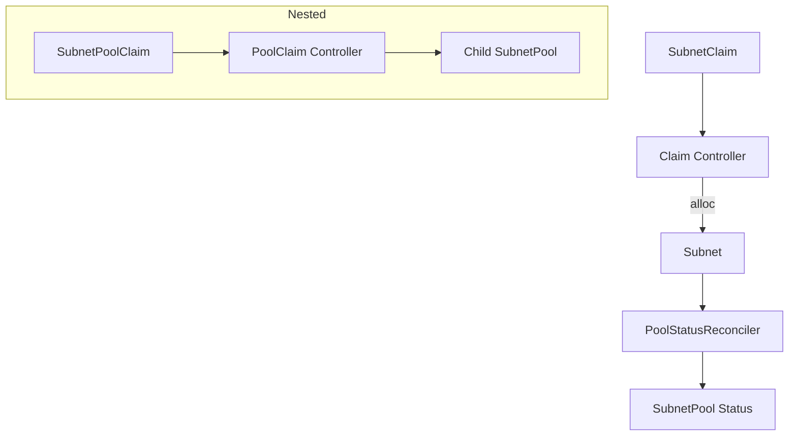

# Concepts

This section introduces the core Custom Resources and allocation mechanics used by Plexaubnet.

---

## SubnetPool

A **SubnetPool** represents the address space from which subnets are allocated.

| Field | Description |
|-------|-------------|
| `spec.cidr` | The root CIDR range (e.g. `10.0.0.0/16`) |
| `spec.defaultBlockSize` | `/`-notation for default claim size (e.g. `24`) |
| `spec.strategy` | Allocation strategy: `Linear` (simple next-free) or `Buddy` (power-of-two split) |
| `status.allocatedCount` | Total allocated blocks |
| `status.freeCountBySize` | Remaining blocks by prefix length |

---

## SubnetClaim

Consumers request CIDR blocks via **SubnetClaim**.

* `spec.poolRef` — name of the source pool
* `spec.clusterID` — idempotency key (no duplicate allocations per cluster)
* `spec.blockSize` **or** `spec.requestedCIDR` — size vs. fixed range

Phases:

| Phase | Meaning |
|-------|---------|
| `Pending` | Waiting for allocation |
| `Bound` | Subnet granted |
| `Error` | Allocation failed / exhausted |

---

## Subnet

The actual allocation record created by the controller.

| Field | Description |
|-------|-------------|
| `spec.cidr` | Assigned range |
| `spec.poolRef` | Parent pool |
| `status.phase` | `Allocated` / `Released` / `Failed` |
| `status.allocatedAt` | RFC3339 timestamp |

---

## SubnetPoolClaim (Nested Pools)

A **SubnetPoolClaim** splits an existing parent pool into a child pool of a different block size. Useful for multi-tenant hierarchies.

* `spec.parentPoolRef` — source pool
* `spec.desiredBlockSize` — target prefix length for child pool CIDR

---

## Allocation Strategies

1. **Linear** — Sequential next-free allocation (default)
2. **Buddy** — Binary splitting algorithm ensuring power-of-two subnets; minimizes fragmentation

---

## Controller Workflow (High-Level)

---

_Last updated: 2025-05-12_ 