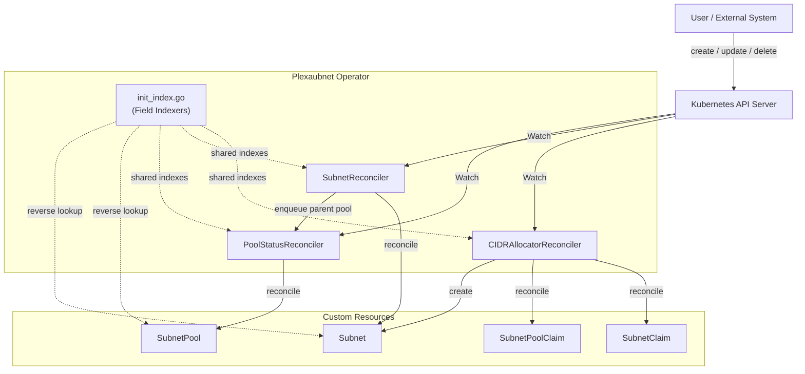
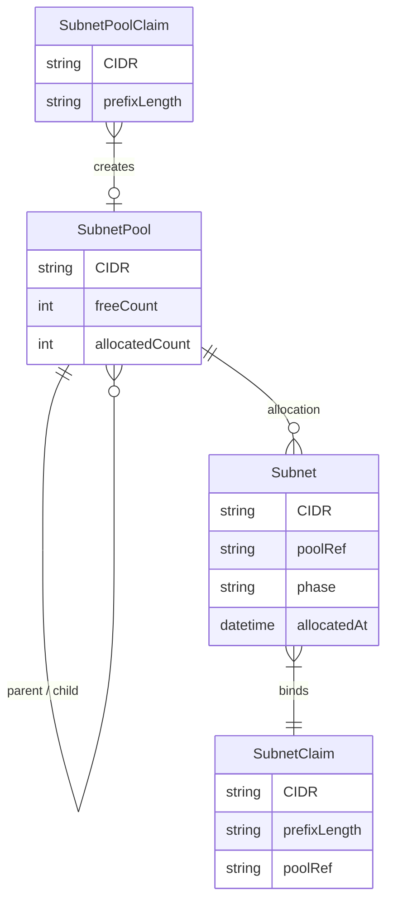
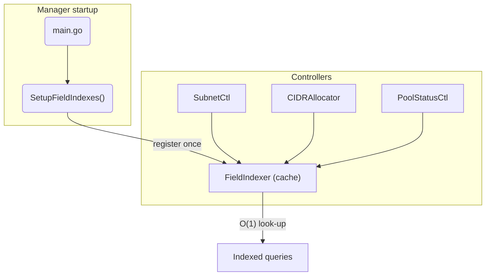
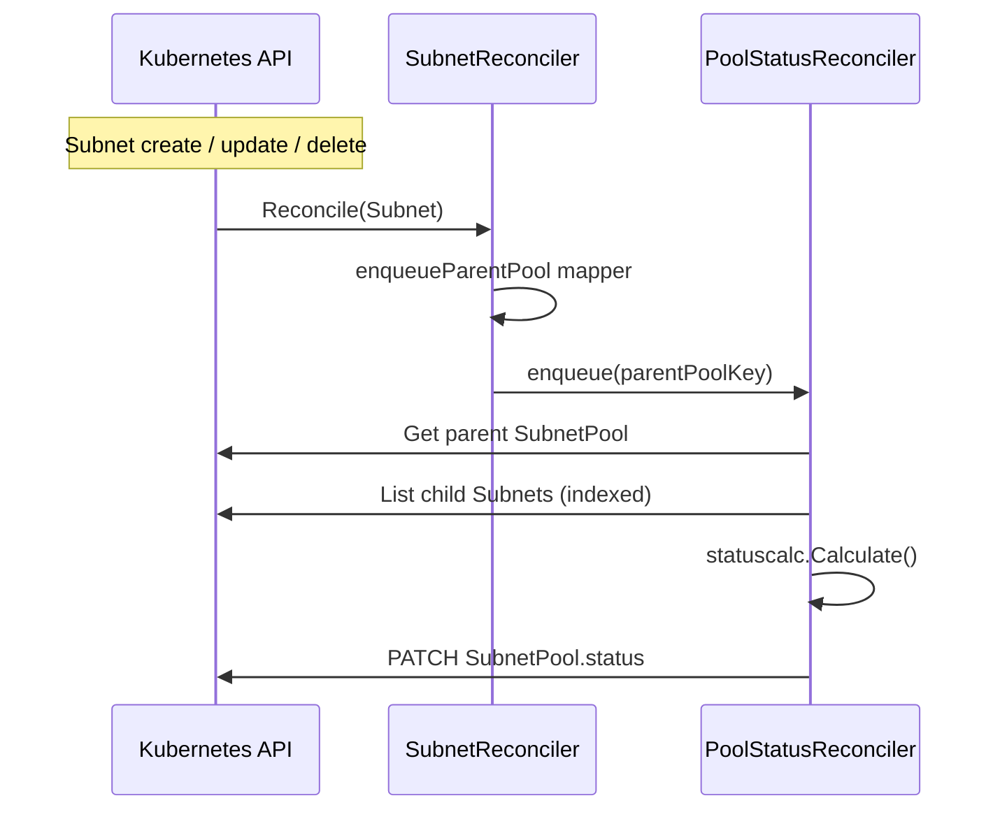
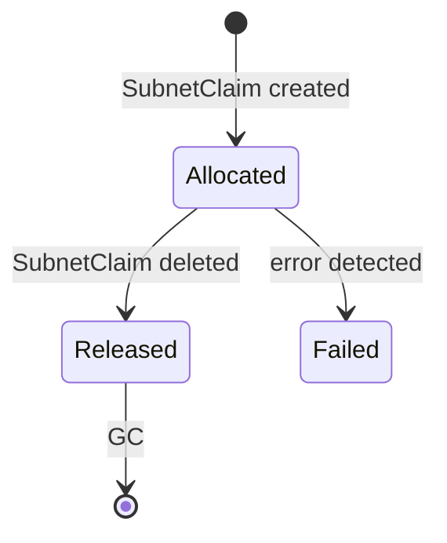
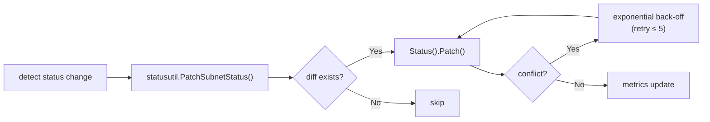

# Plexaubnet Architecture Overview

| Key | Value |
|-----|-------|
| Status | Active |
| Author | @roo |
| Last Updated | 2025-05-12 |

## 1. System Overview

Plexaubnet is an IP Address Management (IPAM) operator that manages CIDR ranges on Kubernetes.  
It offers a hierarchical pool model, automatic CIDR allocation, and centralised status tracking, enabling large-scale network environments to manage IP space declaratively.

## 2. Component Topology



## 3. Controller Responsibilities

| Controller | Responsibility | Trigger | Action |
|------------|---------------|---------|--------|
| **CIDRAllocatorReconciler** | Allocate / release CIDR blocks | SubnetClaim create | Reserve a CIDR block and create a Subnet |
|  |  | SubnetClaim delete | Delete Subnet and free CIDR |
| **SubnetReconciler** | Subnet life-cycle management | Subnet create / update / delete | Update Subnet status, enqueue parent pool |
| **PoolStatusReconciler** | Aggregate pool utilisation | Parent pool enqueued | Recalculate and patch pool status |

*Note:* Pool utilisation is now **only** calculated in **PoolStatusReconciler**; SubnetReconciler no longer performs status aggregation.

## 4. Resource Relationship Diagram



## 5. Centralised Field Indexers

All field indexers are registered **once** in [`internal/controller/init_index.go`](../internal/controller/init_index.go).



### 5.1 Primary Indexes

| Constant | Index Key | Purpose |
|----------|-----------|---------|
| `PoolRefField` | `spec.poolRef` | Reverse lookup Allocation → Pool |
| `ParentPoolLabelIndex` | `metadata.labels[plexaubnet.io/parent]` | Reverse lookup ChildPool → ParentPool |

Additional constant:

| Constant | Value | Purpose |
|----------|-------|---------|
| `PageSize` | `1000` | Default page size for List operations to bound memory |

## 6. Parent-Pool Requeue Strategy

SubnetReconciler detects changes on a Subnet and enqueues the parent pool key for PoolStatusReconciler.



### 6.1 Requeue Triggers

| Event | Description | Implementation |
|-------|-------------|----------------|
| Subnet CRUD | (allocate / release) recalc parent pool | SubnetReconciler `enqueueParentPool` |
| Child pool delete | Return capacity to parent | PoolStatusReconciler `mapChildToParent` |
| Parent pool spec change | CIDR resize etc. | `GenerationChangedPredicate` |

All mapper functions **must** set `Namespace` on `ctrl.Request`; unit tests assert this rule.

## 7. Subnet Status Extension

```yaml
status:
  phase: "Allocated" | "Released" | "Failed"
  allocatedAt: "2025-05-01T12:00:00Z"
```
`ReleasedAt` is implicit—the Subnet CR deletion marks release.

### 7.1 State Flow



## 8. Patch-based Status Updates

Moved from `Status().Update()` to optimistic `Status().Patch()` with back-off:



## 9. Monitoring & Observability

| Metric | Type | Labels | Description |
|--------|------|--------|-------------|
| `subnet_status_update_total` | Counter | `result` | Subnet status updates |
| `subnet_status_conflict_retries_total` | Counter | – | Conflict retries |
| `subnetpool_parent_requeue_total` | Counter | `event_type` | Parent pool enqueues |
| `subnetpool_parent_reconcile_duration_seconds` | Histogram | `result` | Reconcile latency |
| `subnetpool_parent_reconcile_inflight` | Gauge | – | Concurrent reconciles |

## 10. Design Rules

1. **Namespace required**: Every `ctrl.Request` must include `Namespace`.  
2. **Centralised indexers**: Controllers never call `IndexField` directly.  
3. **Patch + Retry**: All status mutations use `Patch` with conflict retry.  
4. **Status.ObservedGeneration**: Persist the current generation on every status patch.  
5. **Predictable constants**: Field index names follow `<resource>.<json-path>`.

/env driven concurrency: `MAX_CONCURRENT_RECONCILES` env var overrides default of `4`.

## 11. Future Work

* Feature flags to disable individual controllers (`ENABLE_POOL_STATUS=false` etc.).  
* Finaliser for `SubnetPoolClaim` to guarantee resource release.  
* Additional Prometheus metrics & Grafana dashboards.  
* Scale tests (performance on >1000 Subnets).