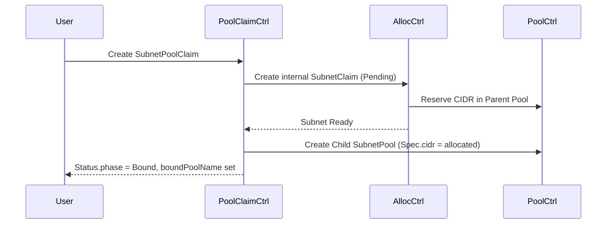

# DESIGN-CIDR-POOLCLAIM-V1
*(SubnetPoolClaim / SubnetPool / SubnetClaim / Subnet — 4-CR Pattern Extension Design)*

---

## 0. Metadata

|Key|Value|
|---|---|
|**Epic / Parent**|AQUA-130 Service Discovery / Globalnet|
|**Document ID**|DESIGN-CIDR-POOLCLAIM-v1|
|**Status**|Implemented|
|**Target Version**|v1alpha1 → v1|
|**Authors**|@dev-sana, @lead-emi|
|**Last Updated**|2025-05-12|
|**Slack Channel**|#aquanaut-dev|

---

## 1. Goals & Non-Goals

### Goals 🎯
1. **Self-Service Hierarchy** — Allow end users to *dynamically* request child SubnetPools
2. **Zero Conflicts** — Ranges allocated to child Pools are **reliably excluded from the parent Pool's free list**
3. **GitOps Friendly** — All requests remain as CRs, maintaining declarative flow
4. **PVC/PV-like UX** — Reduce learning curve with familiar `*Claim → *Pool/Allocation` pattern

### Non-Goals 🚫
* Breaking existing `SubnetClaim` / `Subnet` APIs
* Unlimited nesting depth (this design targets *2 levels* only; deeper nesting may be considered in the future)
* Managing non-IPAM resources (VLANs, MACs, etc.)

---

## 2. Terminology

|Term|Definition|
|---|---|
|**Root Pool**|Top-level `SubnetPool`. Usually statically defined by administrators|
|**Child Pool**|`SubnetPool` dynamically generated via `SubnetPoolClaim`|
|**PoolClaimController**|New controller added in this design|

---

## 3. New CRD — `SubnetPoolClaim`

```go
// +kubebuilder:object:root=true
// +kubebuilder:subresource:status
type SubnetPoolClaim struct {
  metav1.TypeMeta   `json:",inline"`
  metav1.ObjectMeta `json:"metadata,omitempty"`

  Spec   SubnetPoolClaimSpec   `json:"spec,omitempty"`
  Status SubnetPoolClaimStatus `json:"status,omitempty"`
}

type SubnetPoolClaimSpec struct {
  ParentPoolRef    string `json:"parentPoolRef"`
  DesiredBlockSize int    `json:"desiredBlockSize"`
  // +optional for future extensions (e.g., Strategy/Annotations)
}

type SubnetPoolClaimPhase string
const (
  PoolClaimPending SubnetPoolClaimPhase = "Pending"
  PoolClaimBound   SubnetPoolClaimPhase = "Bound"
  PoolClaimError   SubnetPoolClaimPhase = "Error"
)

type SubnetPoolClaimStatus struct {
  ObservedGeneration int64               `json:"observedGeneration,omitempty"`
  Phase              SubnetPoolClaimPhase  `json:"phase,omitempty"`
  BoundPoolName      string              `json:"boundPoolName,omitempty"`
  Message            string              `json:"message,omitempty"`
  Conditions         []metav1.Condition  `json:"conditions,omitempty"`
}
```

> **ShortName**: `subnetpc`
> List status via `kubectl get subnetpoolclaims`

---

## 4. Controller Architecture

|Controller|Responsibility|
|---|---|
|**PoolStatusReconciler (existing)**|`SubnetPool` status aggregation (`status.freeCount`, etc.). Calculates only directly allocated Subnets, excludes child pools|
|**SubnetReconciler (existing)**|`Subnet` lifecycle management and parent Pool requeueing on change events|
|**AllocatorController (existing)**|`SubnetClaim` ↔ `Subnet` lifecycle|
|**PoolClaimController (new)**|`SubnetPoolClaim` ↔ (internal) `SubnetClaim` ↔ `Subnet` → Child `SubnetPool` creation|

### 4.1 PoolClaimController Process Flow



*Internal SubnetClaims use `generateName: <poolclaim>-` to avoid collisions.*

---

## 5. Allocation Algorithm Changes

* **Root Pool**
  * Root Pool status calculations include only directly allocated *Subnets*
  * Child Pools are treated as separate management domains and not reflected in Root Pool status
  * This improves performance in large environments and avoids race conditions (see `docs/issues/child-pool-exclusion.md`)
* **Subnet Uniqueness**
  * Duplicates detected using `(parentPool, CIDR)` key (leveraging existing logic)
* **Child Pool Management**
  * Child Pool → Parent Pool communication occurs only via Indexer + Mapper event forwarding
  * Finalizer ensures `SubnetPoolClaim` deletion → Child Pool deletion
  * Internal Subnet released only after Child Pool is completely gone

---

## 6. RBAC

```yaml
# PoolClaimController
apiVersion: rbac.authorization.k8s.io/v1
kind: ClusterRole
metadata:
  name: aquanaut-cidr-poolclaim-controller
rules:
- apiGroups: ["plexaubnet.io"]
  resources: ["subnetpoolclaims", "subnetpools", "subnetclaims", "subnets"]
  verbs: ["get","list","watch","create","update","patch","delete"]
```

*Controller runs Cluster-wide; Namespace-scoped operation is under consideration for future releases.*

---

## 7. Conditions & Events

|Resource|Condition.Type|True Reason|False Reason|
|---|---|---|---|
|`SubnetPoolClaim`|`Ready`|`Bound`|`ClaimPending`,`Error`|
|`SubnetPool`|`Ready`|`CIDRAssigned`|`WaitingParent`,`Error`|

*Progress visualized step-by-step with `kubectl describe`*

---

## 8. Fail-safes & Edge Cases

1. **Parent Pool CIDR Exhaustion**
   *Internal SubnetClaim marked as `Failed`, PoolClaim `.status.phase = Error`*
2. **Child Pool Name Collision**
   *Auto-numbered with `generateName` (e.g., `finance-tenant-xxxxx`)*
3. **Parent Pool Deletion Request**
   *Admission Webhook **denies** if child Pools exist, preventing cascading deletion*

---

## 9. Migration Strategy

|Step|Task|
|---|---|
|1|Add CRD `subnetpoolclaims.plexaubnet.io`|
|2|Deploy PoolClaimController (FeatureGate `PoolClaim=true`)|
|3|Extend Root Pool `status` (account for child Pool CIDRs)|
|4|Progressively apply `SubnetPoolClaim` for tenants needing child Pools in existing clusters|

---

## 10. Future Extension Ideas

* **Namespace-Scoped Pools** — Simplify RBAC in multi-tenant environments
* **Automatic Shrinking (Coalesce)** — Automatically return child Pool CIDR to parent when empty
* **Quota / LimitRange-like Controls** — Limit maximum CIDR size per tenant

---

### Appendix A — Sample Manifests

```yaml
# 1. Root Pool
apiVersion: plexaubnet.io/v1
kind: SubnetPool
metadata:
  name: world
spec:
  cidr: 10.0.0.0/8
  strategy: Buddy
  defaultBlockSize: 16
---
# 2. Tenant requests a /20 Pool
apiVersion: plexaubnet.io/v1
kind: SubnetPoolClaim
metadata:
  name: finance-tenant-pool
spec:
  parentPoolRef: world
  desiredBlockSize: 20
---
# 3. (Controller created) Child Pool
apiVersion: plexaubnet.io/v1
kind: SubnetPool
metadata:
  name: finance-tenant          # <= boundPoolName
spec:
  cidr: 10.44.0.0/20            # <= allocated
  parentRef:                    # Controller sets
    name: world
status:
  ready: true
```

---

## 🎉 Summary

* **Diverse, Dynamic Subnet Requests** → `SubnetPoolClaim` provides *PVC/PV*-equivalent UX
* **Root Pool** manages both **Subnets + Child Pools** as "in use"
* Only one additional component, **PoolClaimController**, reusing existing logic
* GitOps-friendly with requests (Claims) maintained in history, enhancing auditability