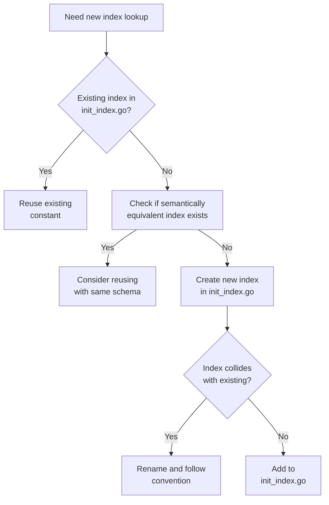

# FieldIndexer Naming Convention & Policy Guide

## 1. Motivation

Controller-runtime FieldIndexers create lookup indexes for Kubernetes objects, enabling efficient O(1) queries in reconciliation logic (instead of O(n) List operations). However, **duplicate indexer registration will fail with errors** when multiple controllers attempt to index the same fields with different names.

This guide establishes:
- Consistent naming conventions for field indexes
- Clear registration patterns
- Decision processes for reuse vs. creation

## 2. Naming Convention

### 2.1 Index Field Path Naming

Field index paths should follow the pattern: `<resource-type>.<json-path>`

| Example | Resource Type | JSON Path |
|---------|---------------|-----------|
| `subnet.spec.poolRef` | Subnet | spec.poolRef |
| `subnetpool.metadata.labels[plexaubnet.io/parent]` | SubnetPool | metadata.labels[plexaubnet.io/parent] |

### 2.2 Constant Naming

Constants defined in `internal/controller/init_index.go` should follow:

| Pattern | Use Case | Example |
|---------|----------|---------|
| `<Field>Field` | Regular field index | `PoolRefField` |
| `<Label>LabelIndex` | Label-based index | `ParentPoolLabelIndex` |
| `<Type>Constant` | General purpose | `PageSize` |

## 3. When to Add a New Index vs. Reuse



### Key Decision Factors

1. **Same query intent**: Is this index querying the same relationship as an existing one?
2. **Identical type+field**: Is it exactly the same type and field being indexed?
3. **Similar value format**: Does the index function return values in the same format?

## 4. How to Register a New Index

All indexes must be registered in `internal/controller/init_index.go` following this process:

1. Add a new constant for the index name
2. Add the index to the `SetupFieldIndexes` function
3. Use the existing `handle` helper function for conflict resolution
4. Document the purpose of the index in a comment

Example:

```go
// NewCustomIndex is the field index for custom field
const NewCustomIndex = "custom.spec.field"

// In SetupFieldIndexes:
if err := handle(idx.IndexField(ctx,
    &ipamv1.CustomType{}, NewCustomIndex,
    func(o client.Object) []string {
        return []string{o.(*ipamv1.CustomType).Spec.Field}
    }), NewCustomIndex); err != nil {
    return err
}
```

## 5. Examples from Existing Code

### Example 1: PoolRefField

```go
// PoolRefField is the field index for spec.poolRef
const PoolRefField = "spec.poolRef"

// Register Subnet -> spec.poolRef
if err := handle(idx.IndexField(ctx,
    &ipamv1.Subnet{}, PoolRefField,
    func(o client.Object) []string {
        return []string{o.(*ipamv1.Subnet).Spec.PoolRef}
    }), PoolRefField); err != nil {
    return err
}
```

### Example 2: ParentPoolLabelIndex

```go
// ParentPoolLabelIndex is the field index for metadata.labels[plexaubnet.io/parent]
const ParentPoolLabelIndex = "metadata.labels[plexaubnet.io/parent]"

// Register SubnetPool -> metadata.labels[plexaubnet.io/parent]
if err := handle(idx.IndexField(ctx,
    &ipamv1.SubnetPool{}, ParentPoolLabelIndex,
    func(o client.Object) []string {
        if p, ok := o.(*ipamv1.SubnetPool); ok {
            if parent, ok := p.Labels["plexaubnet.io/parent"]; ok {
                return []string{parent}
            }
        }
        return nil
    }), ParentPoolLabelIndex); err != nil {
    return err
}
```

### Example 3: PageSize Constant

```go
// PageSize is the default page size for List operations to limit memory usage
const PageSize = 1000
```

This constant is used when implementing paged list operations to prevent memory spikes in high-scale environments:

```go
func (r *PoolStatusReconciler) listPagedAllocations(ctx context.Context, poolName string) ([]ipamv1.Subnet, error) {
    var result []ipamv1.Subnet
    nextToken := ""
    
    for {
        var page ipamv1.SubnetList
        opts := []client.ListOption{
            client.MatchingFields{cidrallocator.PoolRefField: poolName},
            client.Limit(cidrallocator.PageSize),
        }
        
        if nextToken != "" {
            opts = append(opts, client.Continue(nextToken))
        }
        
        if err := r.List(ctx, &page, opts...); err != nil {
            return nil, err
        }
        
        result = append(result, page.Items...)
        
        nextToken = page.Continue
        if nextToken == "" {
            break
        }
    }
    
    return result, nil
}
```

## 6. Using Indexes in Controllers

When using indexes in controllers, always reference the constants defined in `init_index.go`:

```go
// Correct: Use the shared constant
var allocations ipamv1.SubnetList
if err := r.List(ctx, &allocations, 
                 client.MatchingFields{cidrallocator.PoolRefField: pool.Name}); err != nil {
    return ctrl.Result{}, err
}

// Incorrect: ❌ Using string literals 
var allocations ipamv1.SubnetList
if err := r.List(ctx, &allocations, 
                 client.MatchingFields{"spec.poolRef": pool.Name}); err != nil {
    return ctrl.Result{}, err
}
```

## 7. FAQ / Common Pitfalls

### Q: What happens if I register the same index twice?

A: If you register the same index (same field on same type) with different names, the second registration will fail with an `indexer conflict` error. The centralized `init_index.go` approach prevents this by registering all indexes once.

### Q: Do I need a separate index for every controller?

A: No. Indexes should be shared across controllers when they query the same relationships. The indexer is part of the shared cache, available to all controllers using the same manager.

### Q: What if I need a similar but different index?

A: If the indexed resource, field, or returned values differ semantically, create a new index with a distinct name. Document clearly how it differs from similar indexes.

### Q: When might I need to modify an existing index?

A: Only when the underlying API object schema changes (rare) or if there's a bug in the index function. Modifying an index's semantics can silently break other controllers relying on it.

### Q: How do I use the PageSize constant properly?

A: The PageSize constant (1000) should be used with client.Limit() when listing resources to bound memory usage, especially in large environments. Controller-runtime provides continuation tokens for paged queries.

## 8. Enforcement Checklist

Before implementation:
- [ ] Check if an existing index serves the purpose
- [ ] Verify the naming follows the convention
- [ ] Ensure the index is defined in `init_index.go`
- [ ] Ensure all controllers use the constant, not literals

During code review:
- [ ] Check for use of string literals with `client.MatchingFields`
- [ ] Verify any new index follows naming conventions
- [ ] Ensure new constants are properly documented
- [ ] Check that large list operations use paging with PageSize