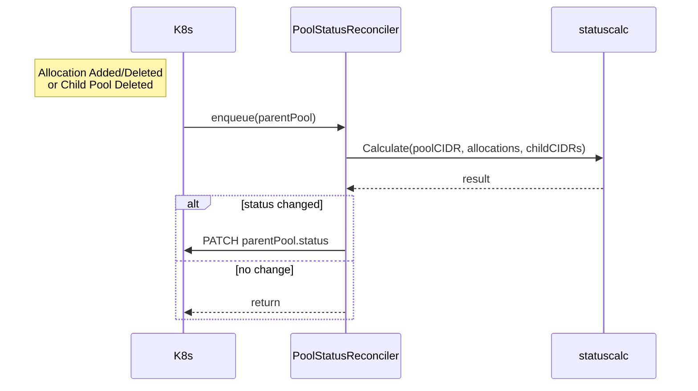

# PoolStatusReconciler Design

## 1. Background
Since `SubnetReconciler` was handling both **Subnet lifecycle** and **SubnetPool free/allocated statistics**, we faced challenges:
* Easy to miss recalculation when child Pools are deleted
* Future Pool extension features (Shrink/Quota etc.) would cause code bloat

Therefore, we're adding a **dedicated controller for Pool status aggregation**.

---

## 2. Goals
* Reliably update **parent Pool status** on child Pool deletion, addition, and updates
* Update status when Allocations are added/removed from a Pool
* Use Indexer + MapFunc for **O(1) reverse lookups**, ensuring scalability in large environments
* Avoid changing existing API and CRD schemas (temporarily using `plexaubnet.io/parent` label)

---

## 3. Non-Goals
* Implementation of `Spec.ParentRef` field (to be addressed in a separate issue)
* Pool shrinking or automatic GC functionality
* Adding Observability/Prometheus metrics (reusing existing metrics)

---

## 4. Controller Responsibilities

| Process | Description |
|---------|-------------|
| Allocation Watch | Reconcile target Pool when Allocations are added/deleted |
| Child Pool Watch | Reconcile parent Pool on child Pool deletion events |
| Status Calculation | Call `statuscalc.Calculate()` to compute freeCount etc. |
| Status Patch | Apply `Status().Patch` only when differences exist (optimistic lock + retry) |

---

## 5. Event Sources & Predicates

```go
// ① Allocation → Pool reverse lookup
Watches(&ipamv1.Subnet{},
  handler.EnqueueRequestsFromMapFunc(r.mapAllocToPool),
)

// ② Child Pool Delete → Parent Pool
Watches(&ipamv1.SubnetPool{},
  handler.EnqueueRequestsFromMapFunc(r.mapChildToParent),
  builder.WithPredicates(predicate.Funcs{
    DeleteFunc: func(e event.DeleteEvent) bool { return true },
    CreateFunc: func(e event.CreateEvent) bool { return false },
    UpdateFunc: func(e event.UpdateEvent) bool { return false },
    GenericFunc: func(e event.GenericEvent) bool { return false },
  }),
)
```

`GenerationChangedPredicate` prevents recursive Reconcile from status-only updates:

```go
// Only allow Reconcile execution on Pool generation changes
For(&ipamv1.SubnetPool{}).
  WithEventFilter(predicate.GenerationChangedPredicate{})
```

Enhanced Child Pool monitoring:
```go
// Enhanced Child Pool Predicate
builder.WithPredicates(predicate.Funcs{
  DeleteFunc: func(e event.DeleteEvent) bool { return true },
  CreateFunc: func(e event.CreateEvent) bool {
    // Child pool creation: only enqueue if plexaubnet.io/parent label exists
    p, ok := e.Object.(*ipamv1.SubnetPool)
    if !ok {
      return false
    }
    _, hasParent := p.Labels["plexaubnet.io/parent"]
    return hasParent
  },
  UpdateFunc: func(e event.UpdateEvent) bool {
    // Recalculate parent Pool if:
    // 1. parent label value has changed, or
    // 2. CIDR has changed
    oldPool, ok1 := e.ObjectOld.(*ipamv1.SubnetPool)
    newPool, ok2 := e.ObjectNew.(*ipamv1.SubnetPool)
    if !ok1 || !ok2 {
      return false
    }

    oldParent, oldHasParent := oldPool.Labels["plexaubnet.io/parent"]
    newParent, newHasParent := newPool.Labels["plexaubnet.io/parent"]
    
    parentChanged := (oldHasParent != newHasParent) || (oldParent != newParent)
    cidrChanged := oldPool.Spec.CIDR != newPool.Spec.CIDR
    
    return parentChanged || cidrChanged
  },
  GenericFunc: func(e event.GenericEvent) bool { return false },
})
```

---

## 6. Field Indexes

Previously defined locally in each controller, field indexes are now centrally managed in `internal/controller/init_index.go`.

```go
// Each controller no longer needs to register indexes themselves
// but simply references controller.PoolRefField or controller.ParentPoolLabelIndex constants.

// These indexes are used for searches like:
// Example: child → parent lookup
client.MatchingFields{"metadata.labels[plexaubnet.io/parent]": parentName}

// Example: allocation → pool lookup
client.MatchingFields{"spec.poolRef": poolName}
```

All Field Indexer registrations happen once in the `SetupFieldIndexes` function, and controllers simply reference these indexes.

---

## 7. Reconcile Flow



---

## 8. Concurrency & Retry
* `controller.Options{MaxConcurrentReconciles: 4}` – Configurable via environment variable `MAX_CONCURRENT_RECONCILES` 
* Exponential retry with `retry.RetryOnConflict` for up to 3 attempts
* Safe operation since framework will automatically requeue on update conflicts

---

## 9. RBAC Changes

```yaml
# config/rbac/poolstatus_controller_role.yaml
rules:
- apiGroups: ["plexaubnet.io"]
  resources: ["subnetpools"]
  verbs: ["get","list","watch","patch","update"]
- apiGroups: ["plexaubnet.io"]
  resources: ["subnets"]
  verbs: ["get","list","watch"]
```

---

## 10. File Layout

```
internal/controller/poolstatus_controller.go   // Main Reconciler
config/rbac/poolstatus_controller_role.yaml
```

---

## 11. Testing Plan

### 11.1 Unit
* **findParentPool** returns correct request on Delete
* **mapAllocToPool** indexes work with fake client
* Verify all mapper functions include Namespace in ctrl.Request objects

### 11.2 Integration (envtest)
1. Create root + child + allocation
2. Delete child Pool
3. Expect parent `status.freeCount` to increase

Added to `make test` and automatically executed in CI.

---

## 12. Future Work
* Replace label with `spec.parentRef` and update Indexer/MapFunc
* Add Pool shrink & automatic GC
* Emit Prometheus metrics for pool fragmentation
* Configure rate limiters for high-volume environments