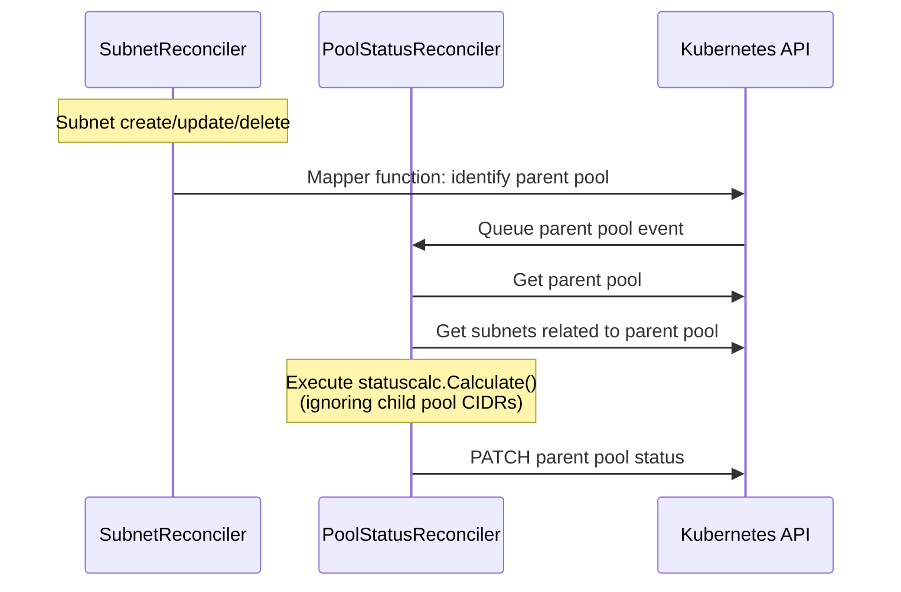
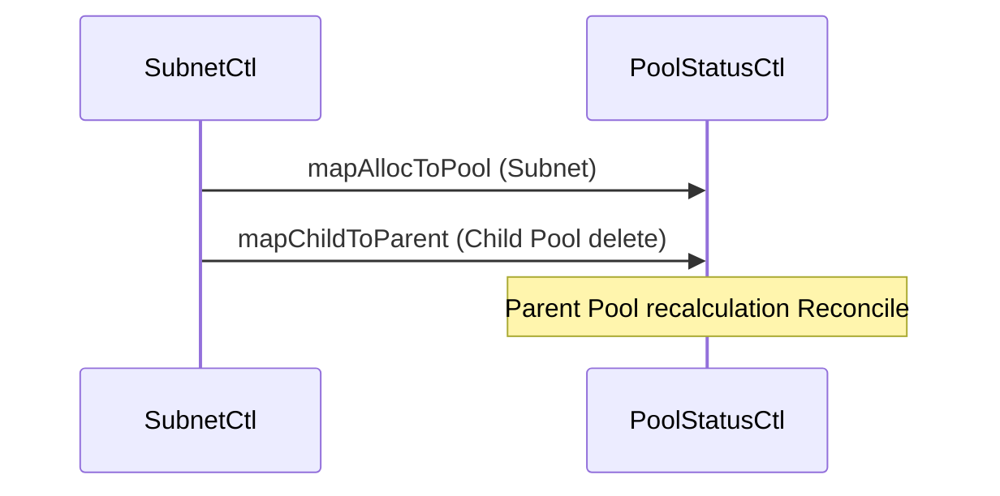
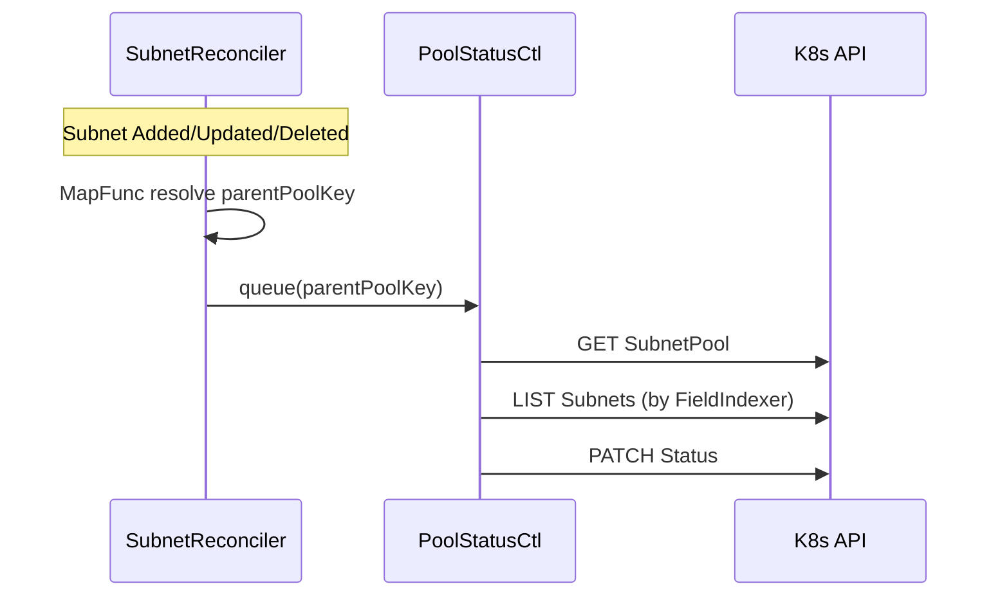
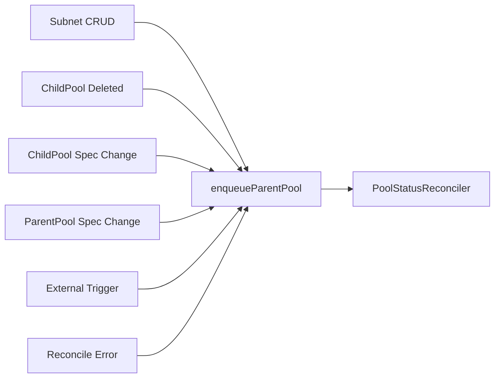

# SubnetPool Requeue Strategy

## Table of Contents
- [Executive Summary](#executive-summary)
- [Glossary](#glossary)
- [1. Background](#1-background)
- [2. Parent Pool Requeue Strategy](#2-parent-pool-requeue-strategy)
- [3. Implementation Details](#3-implementation-details)
- [4. Benefits](#4-benefits)
- [5. Considerations](#5-considerations)
- [6. Future Extensibility](#6-future-extensibility)
- [7. Current Implementation](#7-current-implementation)
- [8. Decision Criteria](#8-decision-criteria)
- [9. Mapper Design (SubnetReconciler)](#9-mapper-design-subnetreconciler)
- [10. Trigger Events](#10-trigger-events)
- [11. Retry & Back-off Policy](#11-retry--back-off-policy)
- [12. Metrics & Observability](#12-metrics--observability)
- [13. References](#13-references)
- [14. Change Log](#14-change-log)

## Executive Summary
This design document defines a strategy for centralizing parent SubnetPool state management within the PoolStatusReconciler. By excluding child pool CIDRs from calculations, computational complexity is reduced to near O(1). The design employs event-driven mapper configuration with custom RateLimiter and detailed metrics to maintain high performance and observability in large-scale environments. Based on a comprehensive evaluation matrix, PoolStatusReconciler has been selected as the official implementation component. This document serves as the final reference for design rationale and change history for subsequent implementation tasks (5.*).

## Glossary
| Term | Definition |
|------|------------|
| SubnetPool | Custom resource that manages IP address ranges as a pool |
| Subnet | IP range actually allocated from a SubnetPool |
| Reconciler | Component responsible for the controller-runtime reconciliation loop |
| Mapper | Function that generates reconciliation target keys from Watch events |
| Requeue | Process of re-adding an object to the work queue for reprocessing |
| CIDR | Classless Inter-Domain Routing, a notation for expressing IP address ranges |
| Parent Pool | Higher-level SubnetPool that contains child SubnetPools |

## 1. Background
Following the removal of `updatePoolStatus` and `getChildPoolCIDRs` functions from SubnetController, a redesign of the parent pool status update mechanism became necessary. This change is based on the following objectives:

- **Centralization**: Consolidate status calculation responsibility in PoolStatusReconciler
- **Simplification**: Eliminate complex data sharing and update logic
- **Scalability**: Exclude child pool CIDRs to reduce computational complexity toward O(1)
- **Consistency**: Reduce the potential for race conditions

## 2. Parent Pool Requeue Strategy



## 3. Implementation Details

### 3.1 SubnetReconciler

- Subnet maintains a reference to parent pool (`Spec.PoolRef`)
- Uses mapper function to enqueue parent pool reconciliation on Subnet create/update/delete events (see Section 10 for details)
- Important: **Does not include status calculation logic**

```go
handler.EnqueueRequestsFromMapFunc(func(ctx context.Context, obj client.Object) []ctrl.Request {
    // Reverse mapping from Subnet to parent Pool
    return []ctrl.Request{{NamespacedName: types.NamespacedName{
        Name:      parentPoolName,
        Namespace: obj.GetNamespace(), // ★IMPORTANT: Namespace must be specified
    }}}
})
```

### 3.2 PoolStatusReconciler

- Uses field indexers for Subnet and Pool to achieve O(1) lookups
- Calculates status using only Subnets belonging to the parent pool
- Excludes child pool CIDRs from calculation (see `docs/issues/child-pool-exclusion.md` for details)
- Implements atomic updates using `client.MergeFrom` and `retry.RetryOnConflict`

```go
// Status calculation excluding child pools
calcResult, err := statuscalc.Calculate(pool.Spec.CIDR, allocations.Items, []string{})
```

## 4. Benefits

- **Clear separation of responsibilities**: SubnetReconciler handles Subnet lifecycle and parent pool requeueing; PoolStatusReconciler handles only status updates
- **Performance improvement**: Excluding child pool CIDRs reduces computational complexity and etcd load
- **Simplified code**: Eliminating complex interactions improves maintainability
- **Scalability**: Field indexers and appropriate predicate filters enable efficient operation in large environments

## 5. Considerations

- When requeueing parent pools from SubnetReconciler, **always include Namespace**
- Excluding child pools may cause UI displays of parent pool free capacity to differ from actual values
- In environments with frequent child pool deletions, deletion event filter settings may need adjustment

## 6. Future Extensibility

- Future introduction of `spec.parentRef` would require only updating indexers and mappers
- Current design accommodates integration with knowledge bases and metrics systems

## 7. Current Implementation

### Event Flow



### Current Issues

1. Excessive reconciliation when a Subnet deletion and child Pool deletion queue the same Pool in rapid succession
2. Namespace omission bug is fixed, but mapper unit tests are lacking
3. CIDRAllocator's complete dependence on PoolStatus creates a bottleneck during event concentrations
4. Race conditions in event chains remain unverified

### Improvement TODOs

- Add mapper unit tests that assert `Namespace` is non-empty
- Consider RateLimiter sharing/duplicate queue suppression logic
- Add lightweight parent enqueue to CIDRAllocator to distribute load
- Add e2e tests for race scenarios

## 8. Decision Criteria

### Evaluation Criteria and Weights
| # | Criterion | Weight | Rationale |
|---|-----------|--------|-----------|
| 1 | Concurrency Handling | 5 | Ease of concurrency control and deadlock avoidance |
| 2 | Event Flow Efficiency | 4 | Minimizing unnecessary reconciliations and optimizing event propagation |
| 3 | Code Ownership & Cohesion | 4 | Improved maintainability through concentrated related logic |
| 4 | Maintainability | 3 | Ease of modification and limited impact scope |
| 5 | Testability | 3 | Ease of writing unit/integration tests |
| 6 | Performance Impact | 3 | Impact on resource consumption/throughput |
| 7 | Operational Observability | 2 | Consistency of logging/metrics |
| 8 | Future Extensibility | 2 | Ease of adding future functionality |

### Evaluation Matrix
| Controller \\ Criterion | 1 | 2 | 3 | 4 | 5 | 6 | 7 | 8 | Weighted Score |
|-------------------------|---|---|---|---|---|---|---|---|----------------|
| **SubnetReconciler** | 2 | 2 | 2 | 3 | 3 | 3 | 2 | 2 | **61** |
| **PoolStatusReconciler** | 5 | 5 | 5 | 4 | 4 | 4 | 4 | 4 | **117** |
| **CIDRAllocatorReconciler** | 3 | 3 | 3 | 3 | 3 | 3 | 3 | 3 | **78** |

#### Decision & Rationale
PoolStatusReconciler achieved the highest total score of **117**, significantly outperforming other candidates in Concurrency Handling and Event Flow Efficiency.
Therefore, this design designates **PoolStatusReconciler** as the official implementation of the parent pool requeue strategy.

## 9. Mapper Design (SubnetReconciler)

### Overview
* SubnetReconciler provides a "parent requeue dedicated mapper" that triggers on **Subnet object CRUD events** to re-enqueue the parent SubnetPool into the PoolStatusReconciler queue
* Handles only minimal metadata with no status calculation, creating clear responsibility boundaries
* Mapper is _idempotent_; duplicate events are suppressed by the work queue's RateLimiter

### Data Structures
| Symbol | Type | Purpose |
|--------|------|---------|
| `parentPoolKey` | `types.NamespacedName` | Reconciliation target key for parent pool |
| `SubnetPoolRefIndexKey` | `string` (const) | FieldIndexer key: `metadata.namespace+spec.poolRef.name` |
| `enqueueParentPool()` | `func(poolKey types.NamespacedName) []ctrl.Request` | Common utility for handler use |

```go
const SubnetPoolRefIndexKey = ".spec.poolRef.name"

func enqueueParentPool(ns, name string) []ctrl.Request {
    return []ctrl.Request{{
        NamespacedName: types.NamespacedName{Namespace: ns, Name: name},
    }}
}
```

### Mapping Logic
```go
// SubnetReconciler SetupWithManager
mgr.GetFieldIndexer().IndexField(
    &api.Subnet{}, SubnetPoolRefIndexKey,
    func(o client.Object) []string {
        sub := o.(*api.Subnet)
        if sub.Spec.PoolRef != "" {
            return []string{sub.Spec.PoolRef}
        }
        return nil
    })

// Watch & Mapper
if err := ctrl.NewControllerManagedBy(mgr).
    For(&api.Subnet{}).
    Watches(&source.Kind{Type: &api.Subnet{}},
        handler.EnqueueRequestsFromMapFunc(
            func(ctx context.Context, obj client.Object) []reconcile.Request {
                sub := obj.(*api.Subnet)
                if sub.Spec.PoolRef == "" { return nil }
                return enqueueParentPool(sub.GetNamespace(), sub.Spec.PoolRef)
            }),
        builder.WithPredicates(predicates.SubnetEvents())).
    Complete(r); err != nil { ... }
```

### Concurrency & Retry
* **Workqueue RateLimiter**: Default exponential back-off (5ms → 1000s), consolidated by key
* **Optimistic Update**: PoolStatusReconciler uses `retry.RetryOnConflict`; retries not needed at mapper layer
* **Duplicate Suppression**: Same `(ns,name)` coalesced to one item in work queue

### Error Handling
1. **Mapper internal errors**
   * `log.FromContext(ctx).Error(err, "mapping Subnet→Pool failed")`
   * `return nil` to suppress failed queue (prevents duplication as Reconciler will notify again)
2. **Nil PoolRef** → early return
3. **Missing Namespace** → impossible (GetNamespace() is always non-empty)

### Namespace Concerns
* **Always set `Namespace`**: `enqueueParentPool(sub.GetNamespace(), poolName)`
* ClusterScope design is out of scope (CRDs are Namespaced)

### Mermaid Diagram


### Unit-test Outline
| # | Scenario | Expectation |
|---|----------|-------------|
| 1 | Subnet with `spec.poolRef` present | Mapper returns `Request{ns, poolRef}` |
| 2 | Subnet missing `poolRef` | Returns empty slice |
| 3 | Mapper called with DeletedFinalStateUnknown | Gracefully handles tombstone |
| 4 | `Namespace` field not empty | Assert `req.NamespacedName.Namespace != ""` |
| 5 | Concurrent events (Create+Delete) | No panic; rate-limited coalesce (fake queue) |

* Use `controller-runtime/envtest` with fake client
* Assert requests via channel capture
* Gorilla `cmp.Diff` for slice equality

### References
* `.roo/rules/controller-development.md` — Namespace must not be empty
* `docs/issues/child-pool-exclusion.md` — Child pool exclusion strategy

## 10. Trigger Events

This section comprehensively lists events that trigger **requeueing** (enqueuing in the PoolStatusReconciler work queue) of parent SubnetPools. Implementation occurs through _mappers_ and `controller-runtime` Watch/Predicate mechanisms.

| # | Event Source | Kubernetes Object | Reason/Action | Predicate/Mapper | Enqueued Parent Key |
|---|--------------|-------------------|---------------|------------------|---------------------|
| 1 | **Subnet CRUD** | Subnet | New allocation / release / update | `predicates.SubnetEvents()` + `enqueueParentPool()` | `ns + spec.poolRef` |
| 2 | **Child Pool Deleted** | SubnetPool (child) | Capacity return during child pool dismantling | `predicates.Deletion()` + `mapChildToParent()` | `ns + spec.parent` |
| 3 | **Child Pool Spec Change** | SubnetPool (child) | `Spec.Allocations`/`CIDR` change | Label/Generation filter | `ns + spec.parent` |
| 4 | **Parent Pool Spec Change** | SubnetPool (parent) | CIDR expansion, etc. | `builder.WithPredicates(updateGeneration)` | self |
| 5 | **External Trigger** | _N/A_ (Webhook/CronJob) | Forced operator recalculation | HTTP Webhook → Controller Runtime Channel | specified `(ns,name)` |
| 6 | **Reconcile Error** | PoolStatusReconciler | Requeue due to previous failure | `RequeueAfter(err)` | self |

> **Note**: Update this table when adding new events.



## 11. Retry / Back-off Policy
To maintain **prompt consistency** while suppressing excessive requeueing, the standard `controller-runtime` `workqueue.RateLimiter` is customized.

### 11.1 Limiter Configuration

| Parameter | Value | Rationale |
|-----------|-------|-----------|
| BaseDelay | `50 * time.Millisecond` | Ensure responsiveness in small clusters |
| MaxDelay  | `30 * time.Second` | Avoid delays >30s even during bursts |
| BucketSize | 100 | Handle spikes in large environments |
| ForgetOnSuccess | ✅ | Reset failure history after success |
| SlowStart Factor | 1.5 | Exponential backoff gradient for consecutive errors |

```go
// In SetupWithManager
rateLimiter := workqueue.NewItemExponentialFailureRateLimiter(
    50*time.Millisecond, 30*time.Second)

ctrl.NewControllerManagedBy(mgr).
    WithOptions(controller.Options{
        RateLimiter: rateLimiter,
        MaxConcurrentReconciles: 5,
    })
```

### 11.2 Policy Summary
1. **Exponential Back-off**: Exponentially delay only if consecutive errors occur on the same key
2. **Duplicate Suppression**: `workqueue` naturally coalesces duplicates
3. **Timeout Guard**: Set 90s `context.WithTimeout` inside Reconcile
4. **Metrics Hook**: Collect `workqueue_adds_total` and `workqueue_retries_total` (see next section)

## 12. Metrics & Observability
Prometheus metrics are defined to visualize parent pool status update **latency** and **failure rate**.

### 12.1 Key Metrics

| Metric | Type | Labels | Description |
|--------|------|--------|-------------|
| `subnetpool_parent_requeue_total` | Counter | `event_type` (`create`, `update`, `delete`) | Total parent requeues (implemented) |
| `subnetpool_parent_reconcile_duration_seconds` | Histogram | `result` (`success`, `error`) | Reconcile duration (implemented) |
| `subnetpool_parent_status_last_timestamp_seconds` | Gauge | `ns`, `name` | Last status update time |
| `subnetpool_parent_reconcile_inflight` | Gauge | _none_ | Concurrent reconciles |
| `workqueue_depth` (built-in) | Gauge | `name="PoolStatus"` | Work queue length |

> **Exporter**: Registered in `metrics.go` `init()` with `controller-runtime/metrics`. Metrics added in task 5 are accessible via `recordParentPoolRequeue` and `recordParentPoolReconcileDuration` functions.

### 12.2 Grafana Query Examples

```grafana
# Parent Pool Reconcile success rate (5m)
sum by(result) (rate(subnetpool_parent_requeue_total{result="success"}[5m])) /
sum by(result) (rate(subnetpool_parent_requeue_total[5m]))

# P95 Reconcile Duration
histogram_quantile(0.95,
  sum(rate(subnetpool_parent_reconcile_duration_seconds_bucket[5m])) by (le))
```


### 12.3 Alert Rules (PrometheusRule snippet)

```yaml
- alert: ParentPoolReconcileErrorRate
  expr: |
    rate(subnetpool_parent_requeue_total{result="error"}[5m]) >
    rate(subnetpool_parent_requeue_total{result="success"}[5m]) * 0.05
  for: 10m
  labels:
    severity: warning
  annotations:
    summary: "ParentPool Reconcile error rate >5%"
```

### 12.4 Mapper Unit-test TODO
- **Assert `Namespace != ""`** for every `ctrl.Request` returned by mapper
  - See [.roo/rules/controller-development.md](md:.roo/rules/controller-development.md) — _Rule #1 Namespace must be set_
- Table-driven test to inject Subnet with/without `spec.poolRef`
- Fake rate-limiter to ensure duplicate suppression

> _Add this TODO to `internal/controller/..._test.go` after completing subtask 3.4._

## 14. Change Log
| Date | Author | Summary |
|------|--------|---------|
| 2025-05-02 | Architect (Roo) | Integrated initial chapter structure, added Executive Summary, Glossary, ToC |
| 2025-05-02 | Architect (Roo) | Scored evaluation matrix and designated PoolStatusReconciler |
| 2025-05-02 | Architect (Roo) | Added Decision & Rationale section |
| 2025-05-02 | Architect (Roo) | Added Change Log, Markdown lint fixes |
| 2025-05-06 | Code (Roo) | Implemented metrics `subnetpool_parent_requeue_total` and `subnetpool_parent_reconcile_duration_seconds` |
| 2025-05-06 | Code (Roo) | Enhanced logging in `mapSubnetToParentPool` and added `eventType` determination logic |
| 2025-05-06 | Code (Roo) | Expanded integration tests - Subnet Rename case and requeue processing time metrics |
| 2025-05-12 | Architect (Roo) | Translated to English, updated with current implementation details |